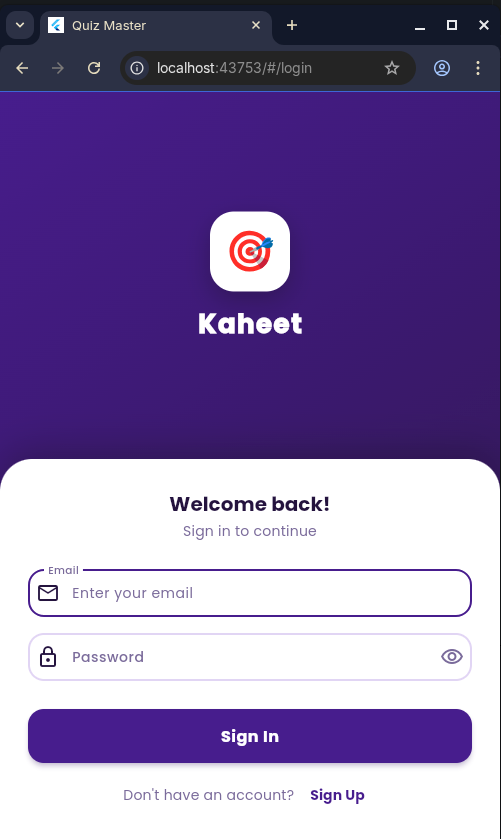
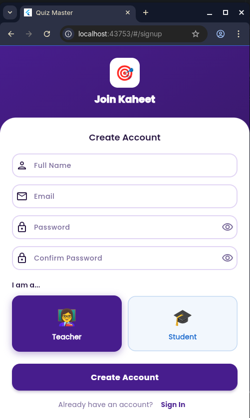
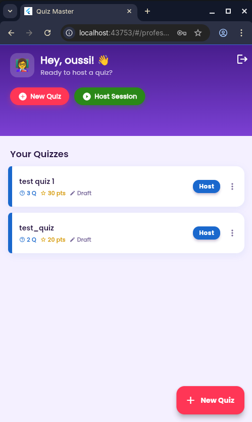
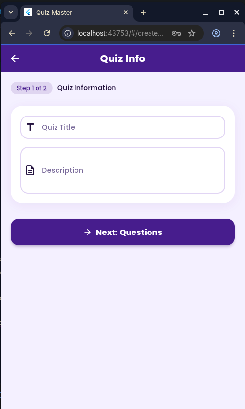
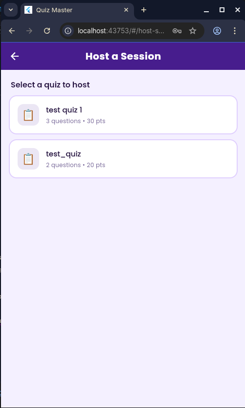
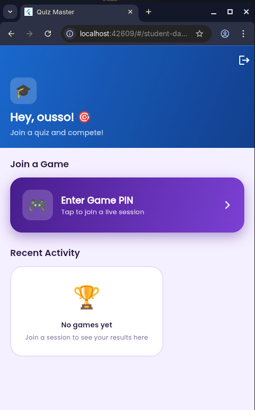
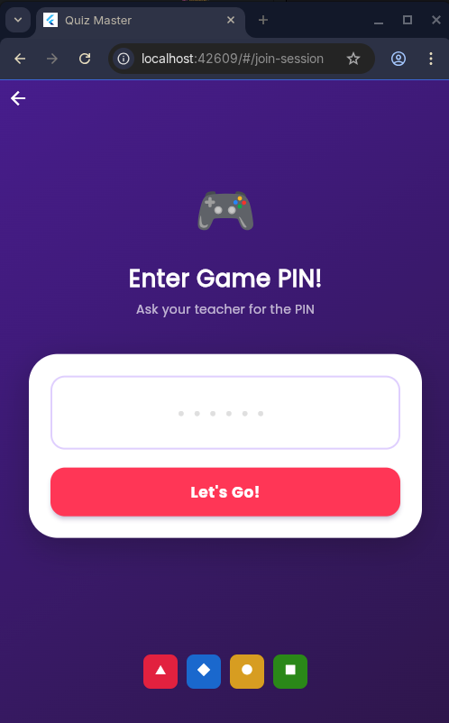
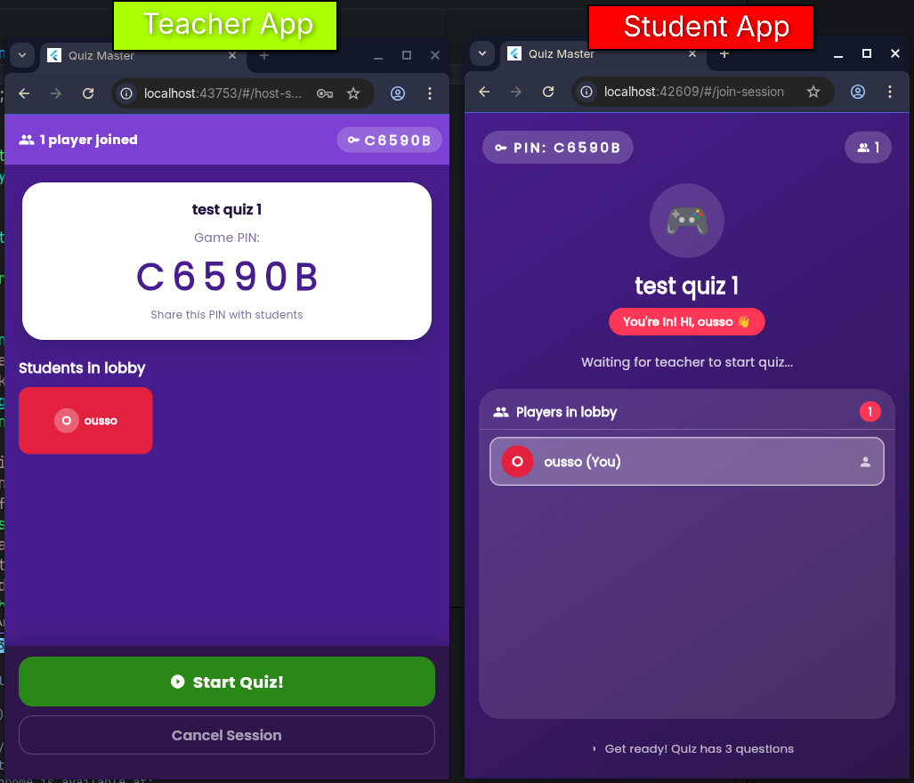

# 🎓 Quiz Master - A Kahoot-like Flutter Application

A modern, interactive quiz application built with Flutter and Firebase. Quiz Master enables educators to create and host live quiz sessions while students can join and compete in real-time.



---

## ✨ Features

### 🔐 **Authentication & User Management**
- Secure email/password authentication with Firebase
- Role-based access: Professor or Student
- Beautiful animated splash screen
- Session persistence and automatic redirect based on user role

### 👨‍🏫 **Professor Features**
- Create and manage quizzes
- Host live quiz sessions with unique session codes
- Monitor real-time participant activity
- View live leaderboards and student scores

### 👨‍🎓 **Student Features**
- Join quiz sessions with session codes
- Participate in live quizzes with multiple question types
- Answer MCQ, True/False, and Short Answer questions
- Track your score and rank in real-time leaderboards

### 🎨 **Modern Design**
- Material Design 3 theme with custom color palette
- Smooth animations and transitions
- Responsive UI that works on mobile, tablet, and web
- Light and dark theme support

---

## 📸 Screenshots

### Authentication Flow
**Login & Sign Up Screens**

 

### Professor Experience
**Dashboard & Quiz Management**

 



### Student Experience
**Join Session & Take Quiz**

 



---

## 🚀 Quick Start

### Prerequisites
- Flutter 3.0+ installed
- Firebase project with Auth, Firestore, and Storage enabled
- A Google account (for Firebase)

### Setup Instructions

1. **Clone the repository**
```bash
git clone https://github.com/oussama-souidi/kaheet
cd flutter_application_1
```

2. **Install FlutterFire CLI** (for Firebase setup)
```bash
dart pub global activate flutterfire_cli
```

3. **Configure Firebase**
```bash
flutterfire configure --project=YOUR_PROJECT_ID
```

4. **Install dependencies**
```bash
flutter pub get
```

5. **Run the app**
```bash
# Android/iOS emulator
flutter run

# Web browser
flutter run -d chrome
```

> For detailed setup instructions, see [SETUP_GUIDE.md](SETUP_GUIDE.md)

---

## 📦 Architecture & Structure

```
lib/
├── config/
│   ├── firebase_config.dart       # Firebase initialization
│   ├── firebase_options.dart      # Firebase credentials
│   └── theme.dart                 # Material Design 3 theme
├── models/
│   ├── user.dart                  # User data model
│   ├── quiz.dart                  # Quiz model
│   └── session.dart               # Session & participant models
├── services/
│   ├── auth_service.dart          # Firebase authentication
│   ├── quiz_service.dart          # Quiz management
│   └── session_service.dart       # Real-time session management
├── providers/
│   └── auth_provider.dart         # State management with Provider
├── screens/
│   ├── auth/                      # Login & sign up screens
│   ├── professor/                 # Professor dashboards
│   └── student/                   # Student dashboards
├── widgets/                       # Reusable UI components
├── utils/
│   └── constants.dart             # App constants & validators
└── main.dart                      # App entry point
```

---

## 🛠️ Tech Stack

- **Frontend Framework:** Flutter
- **State Management:** Provider
- **Backend & Database:** Firebase (Auth, Firestore, Storage)
- **Design:** Material Design 3
- **Animations:** Flutter Animate, Shimmer, Lottie
- **UI Components:** Google Fonts, Flutter UI packages

---

## 📋 Key Dependencies

- `firebase_core` - Firebase initialization
- `firebase_auth` - User authentication
- `cloud_firestore` - Real-time database
- `firebase_storage` - File storage
- `provider` - State management
- `google_fonts` - Typography
- `flutter_animate` - Smooth animations
- `lottie` - Vector animations
- `shimmer` - Loading effects

See [pubspec.yaml](pubspec.yaml) for the complete list of dependencies.

---

## 📚 Next Steps

For implementation details and roadmap, see:
- [IMPLEMENTATION_SUMMARY.md](IMPLEMENTATION_SUMMARY.md) - What's been built and what's next
- [SETUP_GUIDE.md](SETUP_GUIDE.md) - Detailed setup and configuration guide

Priority areas to build next:
1. Quiz Editor for professors
2. Quiz hosting interface
3. Session joining for students
4. Quiz-taking experience
5. Real-time leaderboards

---

## 💡 Highlights

### Built with ❤️
This application was **video-coded using VS Code with GitHub Copilot Student AI plugin**, enabling rapid development with AI-assisted code generation and real-time suggestions.

### Real-time Features
- Live participant tracking
- Real-time leaderboards
- Instant score updates
- Seamless session management

### Production Ready
- Material Design 3 compliance
- Error handling & validation
- Secure Firebase integration
- Responsive design

---

## 📄 License

This project is licensed under the MIT License - see the [LICENSE](LICENSE) file for details.

---

## 🤝 Contributing

Feel free to fork this project and submit pull requests with improvements!

---

**Made with Flutter & Firebase** 🚀
